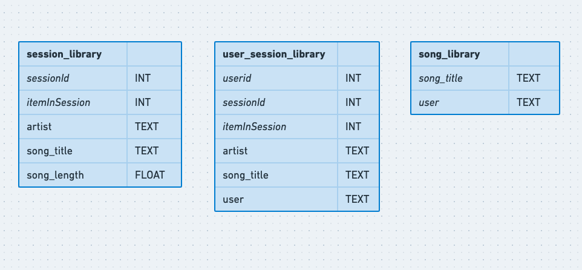

# Project: Data Modeling with Cassandra
## Introduction
A startup called Sparkify wants to analyze the data they've been collecting on songs and user activity on their new music streaming app. The analysis team is particularly interested in understanding what songs users are listening to. Currently, there is no easy way to query the data to generate the results, since the data reside in a directory of CSV files on user activity on the app.

They'd like a data engineer to create an Apache Cassandra database which can create queries on song play data to answer the questions. The goal of the project is to create a database for this analysis. 

## Project Description
In this project, we'll model the data by creating tables in Apache Cassandra to run queries. The first part of the ETL pipeline transfers data from a set of CSV files within a directory to create a streamlined CSV file to model and insert data into Apache Cassandra tables. In, the second part of the file Apache Cassandra tables are created to get the  results of the relevant queries

## Built using
- Python3
- Cassandra(package)
- Apache driver
- IPython

## Dataset

### Evenets Dataset
The dataset is a subset of real data from the [Million Song Dataset](http://millionsongdataset.com/). 
Each file is in CSV format and contains metadata about a song and user activity.

Sample record:

```
{'artist': 'Sydney Youngblood', 'firstName': 'Jacob', 'gender': 'M', 'itemInSession': 53, 'lastName': 'Klein', 'length': 238.07955, 'level': 'paid', 'location': 'Tampa-St. Petersburg-Clearwater, FL', 'sessionId': 954, 'song': "Ain't No Sunshine", 'userId': 73}
```

## Database schema
The following ERD depicts the data model. The three tables show are optimized for the three queries.



## Directory Structure

```
.
├── /
│   ├── event_data/ (contains the CSV logs)
│   ├── images/ (contains relevant images)
│   ├── Project_1B_ Project_Template.ipynb (python notebook to analyse the etl process)
└── README.md (The main readme)
```

## Setting up

Clone the repository using

```sh
git clone https://github.com/biswa-b/udacity-data-engineering-nanodegree
```

### Software Prerequisites

- Python 3.*
- Cassandra(package)
- Apache Cassandra
- IPython

### Steps

- Run the ETL queries in part I of `Project_1B_ETL_Cassandra.ipynb` to pre-process the files.
- `event_datafile_new.csv` will be created
- Next, run the ETL process and create each table one by one. 
- Use the sample queries in `Project_1B_ETL_Cassandra.ipynb` to query the data


