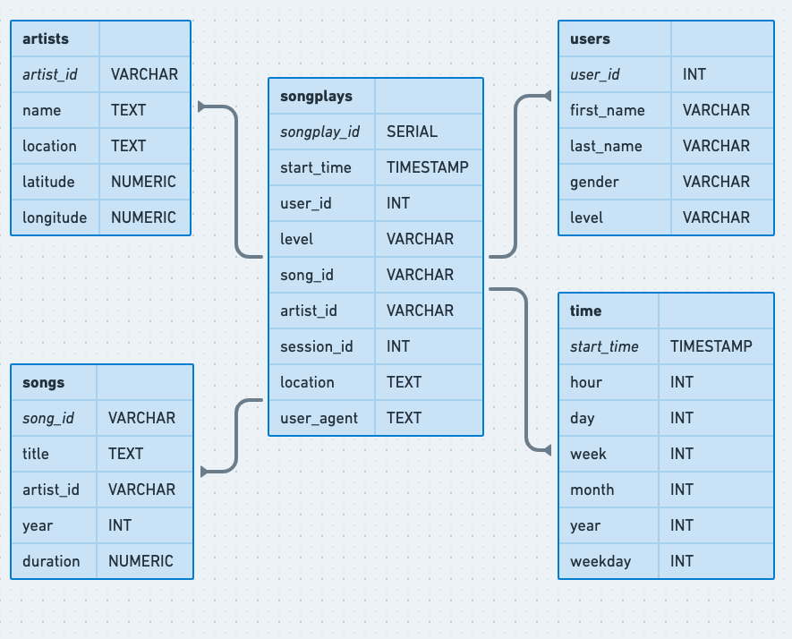

# Project: Data Modeling with Postgres
## Introduction
A startup called Sparkify wants to analyze the data they've been collecting on songs and user activity on their new music streaming app. 
The analytics team is particularly interested in understanding what songs users are listening to. 
Currently, they don't have an easy way to query their data, which resides in a directory of JSON logs on user activity on the app, 
as well as a directory with JSON metadata on the songs in their app.

They'd like a data engineer to create a Postgres database with tables designed to optimize queries on song play analysis. 
The goal of the project is to create a database schema and ETL pipeline for this analysis. 

## Project Description
In this project, we will perform data modeling with Postgres and build an ETL pipeline using Python. 
The fact and dimension tables for a star schema for a particular analytic focus were created, 
as well as the ETL pipeline that transfers data from files in two local directories into these tables in Postgres using Python and SQL was developed.

## Built using
- Python3
- psycopg2
- PostGreSQL
- iPython notebooks

## Dataset

### Song Dataset
The first dataset is a subset of real data from the [Million Song Dataset](http://millionsongdataset.com/). 
Each file is in JSON format and contains metadata about a song and the artist of that song.

Sample record:

```
{"num_songs": 1, "artist_id": "ARJIE2Y1187B994AB7", "artist_latitude": null, "artist_longitude": null, "artist_location": "", "artist_name": "Line Renaud", "song_id": "SOUPIRU12A6D4FA1E1", "title": "Der Kleine Dompfaff", "duration": 152.92036, "year": 0}
```

### Log Dataset
The second dataset consists of log files in JSON format generated by this [Event Simulator](https://github.com/Interana/eventsim) based on the songs in the dataset above. 
These simulate activity logs from a music streaming app based on specified configurations.

Sample Record:

```
{ 'artist': 'Stephen Lynch', 'auth': 'Logged In', 'firstName': 'Jayden', 'gender': 'M', 'itemInSession': 0, 'lastName': 'Bell', 'length': 182.85669, 'level': 'free', 'location': 'Dallas-Fort Worth-Arlington, TX', 'method': 'PUT', 'page': 'NextSong', 'registration': 1540991795796.0, 'sessionId': 829, 'song': "Jim Henson's Dead", 'status': 200, 'ts': 1543537327796, 'userAgent': 'Mozilla/5.0 (compatible; MSIE 10.0; Windows NT 6.2; WOW64; Trident/6.0)', 'userId': '91' }
```

## Database schema
Using the song and log datasets, a star schema optimized for queries on song play analysis was created. The following ERD depicts the data model.



## Directory Structure

```
.
├── /
│   ├── data/ (contains the JSON logs)
│   │   ├── log_data/
│   │   │   └── ....... (contains playback logs)
│   │   ├── song_data/
│   │   │   └── ....... (contains song logs)
│   ├── images/ (contains relevant images)
│   ├── etl.ipynb (python notebook to analyse the etl process)
│   ├── test.ipynb (python notebook to test the data inserted)
│   ├── README.md (Readme file)
│   ├── create_tables.py (Resets the database by dropping & recreating the tables)
│   ├── etl.py (Loads data from song_data and log_data and inserts into the database)
│   └── sql_queries.py (Contains SQL queries for loading & ETL)
└── README.md (The main readme)
```

## Setting up

Clone the repository using

```sh
git clone https://github.com/biswa-b/udacity-data-engineering-nanodegree.git
```

### Software Prerequisites

- Python 3.*
- PostgreSQL
- psycopg2
- IPython

### Steps

- Run `create_tables.py` to reset the database

   ```python
   python3 create_tables.py
   ```

- Next, run the ETL process in `etl.py` and load the data

   ```python
   python3 etl.py
   ```

- Check if the data has been loaded in the database by running the queries in `test.ipynb`

